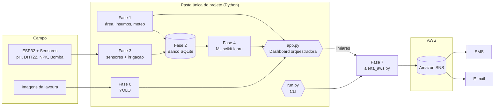

# 🌱 FarmTech Solutions — Sistema Integrado de Agronegócio (Fase 7)

> Consolidação das Fases 1 a 6 em uma única pasta de projeto Python, com uma
> **dashboard integradora** (Streamlit) e um **serviço de mensageria na AWS**
> que dispara alertas com ações corretivas.

---

## 1. Grupo e integrantes

- **Grupo:** 1TIAO
- **Integrantes:**
  - Silvio Prestes Guerreiro Junior — RM567958
- **Curso/Fase:** FIAP — Fase 7 (Consolidação de um Sistema)
- **Setor de aplicação:** Agronegócio (arquitetura genérica e parametrizável)

---

## 2. Visão geral — do sensor ao alerta

O sistema modela uma fazenda inteligente. Sensores no campo (ESP32) medem
**pH, umidade, temperatura e nutrientes (NPK)** e acionam automaticamente a
**bomba de irrigação**. As leituras são gravadas em um **banco de dados**,
analisadas por **modelos de Machine Learning** e exibidas em uma **dashboard**.
Em paralelo, a **visão computacional (YOLO)** inspeciona imagens da lavoura em
busca de pragas/doenças. Quando qualquer medição ou detecção ultrapassa um
**limiar crítico**, o sistema dispara um **alerta por e-mail/SMS (AWS SNS)** aos
funcionários, **sugerindo a ação corretiva**.

```
 Sensores/ESP32 ─┐
 Meteorologia ───┤→  Banco de Dados  →  ML (previsões)  →  Dashboard
 Imagens/YOLO ───┘                                   │
                                                     └→  Limiares → Alertas (AWS SNS) → e-mail/SMS
```

---

## 3. Arquitetura e fluxo de dados



**Fluxo:** Fase 1 (base/meteo) → Fase 2 (banco) → Fase 3 (IoT) → Fase 4
(ML/dashboard) → Fase 6 (visão) → **Fase 7 (alertas AWS)**.

---

## 4. Resumo das fases (1–6) e o que a Fase 7 integrou

| Fase | Entrega | Onde está no projeto |
|------|---------|----------------------|
| **1** | Cálculo de área de plantio, manejo de insumos, API meteorológica pública e análise estatística em R | `fase1_base_dados/` |
| **2** | Banco relacional (MER/DER) integrando os dados de manejo e sensores | `fase2_banco_dados/` |
| **3** | IoT com ESP32 (pH/LDR, umidade/DHT22, NPK), CRUD ligado ao banco e acionamento automático da bomba | `fase3_iot/` |
| **4** | Dashboard com ML (Scikit-Learn) + Streamlit; previsões de umidade e pH | `fase4_ml_dashboard/` + `app.py` |
| **5** | Infra em Cloud (AWS) com segurança (ISO 27001/27002) | `fase5_cloud/README_cloud.md` |
| **6** | Visão computacional com YOLO para saúde da lavoura (pragas/doenças) | `fase6_visao/` |

**A Fase 7 integrou tudo:** uma **dashboard única** (`app.py`) que dispara cada
fase por botões, um **CLI equivalente** (`run.py`), e o **serviço de mensageria
AWS** (`fase7_alertas/alerta_aws.py`) que monitora limiares e alerta com ação
corretiva.

> O banco já vem semeado com **1.021 leituras reais** exportadas do simulador
> Wokwi (`data/Sensores_limpo.xlsx`).

---

## 5. Como executar

### Pré-requisitos
- Python 3.10+ e `pip`
- (Opcional) R, para `analise_estatistica.R`

### Passo a passo
```bash
# 1) (recomendado) criar ambiente virtual
python -m venv .venv
# Windows:  .venv\Scripts\activate
# Linux/Mac: source .venv/bin/activate

# 2) instalar dependências
pip install -r requirements.txt

# 3) (opcional) configurar variáveis de ambiente
cp .env.example .env       # e edite se quiser usar AWS/Oracle/OWM

# 4) inicializar o banco (cria + semeia com os dados reais)
python run.py --init-db

# 5) abrir a dashboard integradora
streamlit run app.py
```

### Comandos equivalentes no terminal (`run.py`)
```bash
python run.py --fase 1            # área + insumos + meteorologia
python run.py --fase 2            # consultas ao banco
python run.py --fase 3 --n 5      # gera 5 leituras de sensores
python run.py --fase 4 --treinar  # treina os modelos de ML
python run.py --fase 6            # roda a visão computacional (YOLO)
python run.py --fase 7            # avalia a última leitura e alerta
python run.py --alerta            # dispara um alerta de TESTE manual
python run.py --export-csv        # exporta CSV para a análise em R
```

### Análise estatística em R (Fase 1)
```bash
python run.py --export-csv
Rscript fase1_base_dados/analise_estatistica.R
```

---

## 6. AWS — serviço de mensageria (Fase 7)

O serviço (`fase7_alertas/alerta_aws.py`) usa **Amazon SNS** via **boto3** para
enviar **e-mail** (tópico SNS) e **SMS** (publish direto). Quando **não há
credenciais** no `.env`, ele entra automaticamente em **MODO SIMULADO**,
imprimindo no terminal exatamente o que seria enviado — assim a demo/vídeo
roda offline, sem custo.

**Como configurar a AWS (resumo):**
1. Crie um tópico SNS `alertas-fazenda` e copie o **ARN**.
2. Assine o e-mail do funcionário e confirme o link.
3. Crie um usuário IAM com permissão mínima `sns:Publish`.
4. Preencha `AWS_*`, `SNS_TOPIC_ARN`, `EMAIL_DEST`, `PHONE_DEST` no `.env`.

O passo a passo completo, a política IAM e o mapeamento de **segurança
ISO 27001/27002** estão em **[`fase5_cloud/README_cloud.md`](fase5_cloud/README_cloud.md)**.

> **Nota ISO 27001/27002:** segredos ficam fora do código (`.env` no
> `.gitignore`), o usuário IAM segue o **princípio do menor privilégio**, e
> todos os disparos são auditados na tabela `ALERTAS_LOG` (controle A.12.3).

### Prints da solução AWS
As capturas ficam em **`docs/prints_aws/`**. Inclua:
1. Tópico SNS criado (com ARN) · 2. Assinatura de e-mail confirmada ·
3. Política IAM mínima · 4. E-mail/SMS recebido com a ação corretiva.

```
docs/prints_aws/
├── 01_topico_sns.png
├── 02_assinatura_email.png
├── 03_politica_iam.png
└── 04_alerta_recebido.png
```

---

## 7. Tabela de limiares → ação corretiva → canal

Parametrizada em `config/settings.py` (`LIMIARES`):

| Origem | Condição (limiar) | Ação corretiva sugerida | Canal | Severidade |
|--------|-------------------|-------------------------|-------|------------|
| Fase 3 — Umidade (DHT22) | umidade < 30% | Acionar irrigação imediata no setor | SMS + e-mail | EMERGÊNCIA |
| Fase 3 — pH (LDR) | pH < 5.5 ou > 7.5 | Aplicar correção de pH / verificar solo | e-mail | ALERTA |
| Fase 3 — Temperatura | T ≥ 40 °C | Reforçar irrigação; risco de estresse térmico | SMS + e-mail | EMERGÊNCIA |
| Fase 1 — Meteorologia | chuva > 80% em 6h | Suspender irrigação programada | e-mail | ALERTA |
| Fase 6 — YOLO | praga/doença, confiança > 0.6 | Inspeção e tratamento fitossanitário no talhão | SMS + e-mail | EMERGÊNCIA |

> Para adaptar a outro setor, basta editar `CULTURAS` e `LIMIARES` em
> `config/settings.py` — o código não muda.

---

## 8. 🎥 Vídeo demonstrativo (YouTube — não listado)

**Link:** `<<< COLE AQUI O LINK DO YOUTUBE (NÃO LISTADO) >>>`

Roteiro sugerido (≤ 5 min): visão geral → dashboard (Fases 1–6) → disparo de
alerta na Fase 7 (modo simulado e/ou AWS real) → prints da AWS.

---

## 9. Estrutura de pastas

```
1TIAO_Fase7_FarmTech/
├── app.py                      # Dashboard Streamlit = orquestrador central
├── run.py                      # CLI: dispara serviços via terminal (argparse)
├── requirements.txt
├── .env.example                # Variáveis (AWS_*, EMAIL_DEST, PHONE_DEST, meteo…)
├── .gitignore
├── README.md
├── config/
│   └── settings.py             # Limiares, ações corretivas, parâmetros centrais
├── data/
│   └── Sensores_limpo.xlsx     # 1.021 leituras reais (seed do banco)
├── fase1_base_dados/
│   ├── calculo_area.py         # Cálculo de área de plantio
│   ├── manejo_insumos.py       # Cálculo/manejo de insumos
│   ├── api_meteorologica.py    # API meteo pública (Open-Meteo, sem chave)
│   └── analise_estatistica.R   # Análise estatística em R
├── fase2_banco_dados/
│   ├── modelo_der.md           # MER/DER documentado (mermaid)
│   ├── schema.sql              # DDL das tabelas
│   └── db.py                   # Conexão + CRUD reaproveitável (SQLite/Oracle)
├── fase3_iot/
│   ├── esp32_irrigacao.ino     # Código ESP32 (Wokwi)
│   ├── diagram.json            # Diagrama Wokwi (DHT22, LDR, NPK, relé)
│   ├── sensores.py             # Leitura simulada/real (pH, umidade, NPK)
│   └── logica_irrigacao.py     # Regra de acionamento da bomba
├── fase4_ml_dashboard/
│   ├── modelo_ml.py            # Treino/predição scikit-learn (umidade/pH)
│   └── graficos.py             # Visualizações (Altair + matplotlib)
├── fase5_cloud/
│   └── README_cloud.md         # Infra AWS + ISO 27001/27002
├── fase6_visao/
│   ├── detector_yolo.py        # Inferência YOLO (modo real + simulado)
│   └── imagens/                # Imagens estáticas de teste
├── fase7_alertas/
│   └── alerta_aws.py           # Mensageria SNS/SES + lógica de limiar/ação
└── docs/
    └── prints_aws/             # Capturas da solução AWS p/ o README
```

---

## 10. Notas técnicas

- **Banco padrão:** SQLite (`data/farmtech.db`), portátil e offline. Oracle é
  opcional via `DB_BACKEND=oracle`.
- **Meteo padrão:** Open-Meteo (sem chave). OpenWeatherMap é opcional.
- **YOLO / Fase 6:** roda com Ultralytics se instalado (`pip install ultralytics`);
  senão, usa modo simulado determinístico.
  > ⚠️ **Imagens de exemplo:** os arquivos em `fase6_visao/imagens/`
  > (`amostra_lavoura_*.jpeg`) são **ilustrações sintéticas** geradas por
  > `fase6_visao/gerar_amostras.py` apenas para a demonstração rodar offline —
  > **não são fotos reais** e a detecção exibida é simulada. No modo simulado o
  > rótulo de cada imagem é derivado do nome do arquivo (`_MAPA_AMOSTRAS` em
  > `detector_yolo.py`). Em **produção**, troque por **fotos reais** de
  > pragas/doenças e um modelo YOLO treinado (`best.pt`): o detector passa a
  > rodar em modo real automaticamente, sem alterar o código.
- **Alertas:** AWS SNS quando há credenciais; senão, modo simulado.
- Todo o sistema **roda após `pip install -r requirements.txt`**, sem
  dependências externas obrigatórias.
