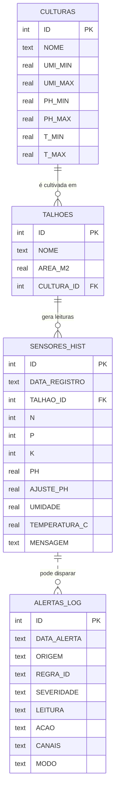

# Modelo de Dados — Fase 2 (MER / DER)

**Grupo 1TIAO — FarmTech Solutions**

Este documento descreve o **Modelo Entidade-Relacionamento (MER)** e o
**Diagrama Entidade-Relacionamento (DER)** do banco que integra os dados de
manejo (Fase 1) e as leituras de sensores em tempo real (Fase 3).

O banco padrão é **SQLite** (`data/farmtech.db`), criado por `schema.sql` e
gerenciado por `db.py`. A modelagem é compatível com Oracle (ver notas no
final do `schema.sql`).

---

## 1. Entidades e atributos (MER)

**CULTURAS** — catálogo de culturas e suas faixas agronômicas ideais.
- `ID` (PK)
- `NOME` (único: Soja, Milho, Algodão…)
- `UMI_MIN`, `UMI_MAX` — faixa ideal de umidade (%)
- `PH_MIN`, `PH_MAX` — faixa ideal de pH
- `T_MIN`, `T_MAX` — faixa ideal de temperatura (°C)

**TALHOES** — setores/áreas da fazenda (liga-se à Fase 1: área de plantio).
- `ID` (PK)
- `NOME`
- `AREA_M2` — área calculada (Fase 1)
- `CULTURA_ID` (FK → CULTURAS.ID)

**SENSORES_HIST** — histórico de leituras dos sensores (núcleo do sistema).
- `ID` (PK)
- `DATA_REGISTRO` — data/hora da leitura
- `TALHAO_ID` (FK → TALHOES.ID)
- `N`, `P`, `K` — nutrientes
- `PH`, `AJUSTE_PH` — pH e correção aplicada
- `UMIDADE` — umidade do solo (%)
- `TEMPERATURA_C` — temperatura (°C)
- `MENSAGEM` — diagnóstico/estado da bomba

**ALERTAS_LOG** — registro de alertas disparados pela Fase 7.
- `ID` (PK)
- `DATA_ALERTA`, `ORIGEM`, `REGRA_ID`, `SEVERIDADE`
- `LEITURA`, `ACAO`, `CANAIS`, `MODO` (AWS/SIMULADO)

---

## 2. Relacionamentos

- Uma **CULTURA** pode estar em vários **TALHÕES** (1:N).
- Um **TALHÃO** possui muitas leituras em **SENSORES_HIST** (1:N).
- **ALERTAS_LOG** referencia logicamente uma leitura/origem (registro de auditoria).

---

## 3. DER (diagrama)

---

## 4. Fluxo de dados no banco

1. **Fase 1** calcula a área de plantio → vira `TALHOES.AREA_M2`.
2. **Fase 3** (ESP32/Wokwi → `sensores.py`) grava leituras em `SENSORES_HIST`.
3. **Fase 4** lê `SENSORES_HIST` para treinar/avaliar os modelos de ML.
4. **Fase 7** lê a última leitura, avalia limiares e grava em `ALERTAS_LOG`.

> O banco é semeado automaticamente com **1.021 leituras reais**
> (`data/Sensores_limpo.xlsx`) exportadas do simulador Wokwi na Fase 3.
